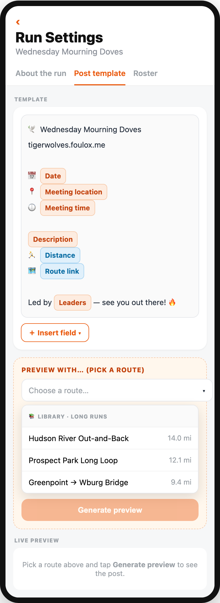
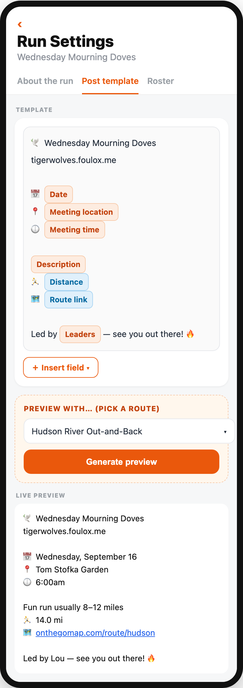
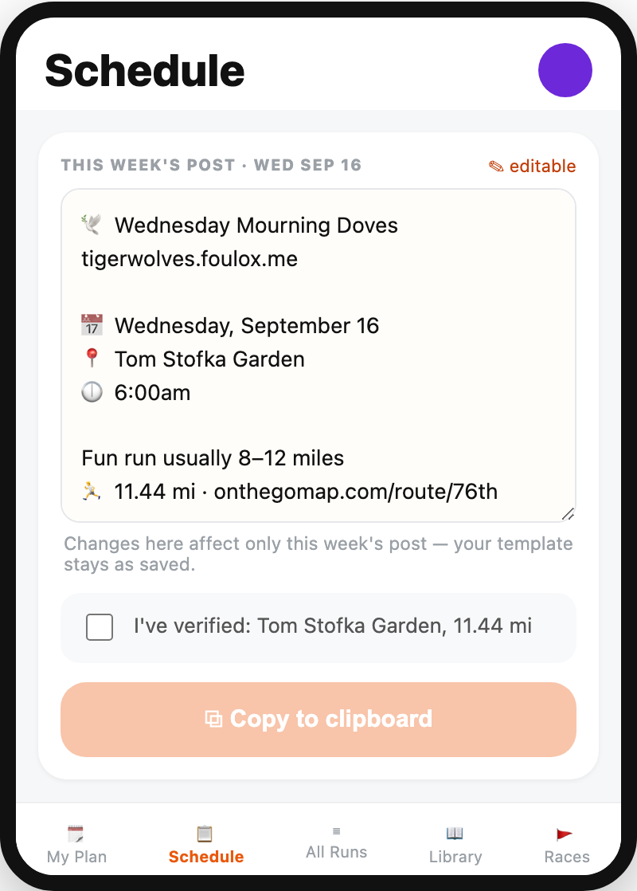

# Heylo post for route-based runs + a real template authoring loop

Blessed design from a brainstorming session (2026-09-15). This is the
contract for the epic and its stories. **The build must match these
mockups.** If implementation needs to deviate, update this doc in the
same PR — don't let the shipped UI drift from what was agreed here.

## Why

The Heylo post generator was built for TigerWolves (a workout-based
run). Route-based runs like Mourning Doves ride on that workout-shaped
template, so their posts are wrong in three ways:

- **No route link** — the app stores a route's map link and shows it on
  run cards, but the generated post never includes it. For a route run,
  the route is the single most important thing.
- **Missing description / distance** — the run's Description ("Fun run
  usually 8–12 miles") and distance are dropped from the post.
- **Dead weight** — a `WARMUP DESCRIPTION` field on Run Settings
  collects text that nothing ever displays.

Underneath, the template editor is four blind text boxes and a Save
button. A leader can't see what they're shaping without leaving for the
schedule page. And once a post is generated, it's read-only — the
"I've verified…" checkbox asks the leader to confirm the post is right
but gives them no way to fix it.

## The design

### 1. Template editor — merge fields + library picker + live preview

The **Post template** tab becomes a three-zone composer. Same machine
for every run; only the picker's contents change by run type.

**Zone 1 — Template.** The post is composed of frame text plus
**merge-field chips**. A leader inserts fields from an **＋ Insert
field** dropdown; nothing is hand-typed as raw syntax, and nothing is
AI-guessed. The dropdown lists the unified `POST_FIELDS` catalog — 11
fields, one list grouped by source. All fields are available regardless
of run type; the leader picks what belongs in their template:

| Field | Source group |
|---|---|
| Date | schedule |
| Day leader | schedule |
| Location | run |
| Time | run |
| Description | run |
| Leaders | roster |
| Workout name | record |
| Reason | record |
| Workout block | record (includes turnaround; no standalone turnaround field) |
| Distance | record |
| Route link | record |

**Zone 2 — Preview with… (pick a record).** A picker that lists the
**library filtered to this run's type** — long runs for Doves, quality
workouts for TigerWolves — headed `📚 Library · <type>`. The leader
picks a record, then taps **Generate preview**.

**Zone 3 — Live preview.** Empty until Generate is tapped; then it
renders the exact post with the run's settings + the picked record's
data merged in.

**Decision — Generate is a manual button**, not an auto-refresh. It's
predictable and cheap, and it makes generating a deliberate act.

### 2. Route-based post content

Delivered *through* the merge fields above: once Description, Distance,
and Route link are insertable and resolve for route runs, a route post
carries the content that matters. No separate hardcoded route template.

### 3. Remove the orphaned warmup field

Delete the unused `WARMUP DESCRIPTION` input from Run Settings. It
saves to the DB but is never read by post generation or any UI.

### 4. Weekly post is always editable

On the schedule page, the generated post is a **live editable field** —
no Edit button to click. A passive "✎ editable" cue signals it can be
edited. Edits are **ephemeral: this-week-only**, and do not change the
saved template.

This closes the loop the "I've verified…" checkbox opened: verify now
means confirm it's right *and fix it if it isn't*.

## Interactive mockups

The PNGs above are snapshots. The clickable originals live next to this
doc — open them in a browser to try Insert field, the picker, Generate,
and inline editing:

- [`mockups/template-editor.html`](mockups/template-editor.html)
- [`mockups/schedule-inline-edit.html`](mockups/schedule-inline-edit.html)

## Open decisions carried to grooming

- **Story slicing** — the template editor and route-based post content
  are intertwined (route content is delivered via merge fields); likely
  one story, but grooming may split the merge-field engine from the
  editor UI.
- **Edit vs. regenerate** — if a leader edits the weekly post inline
  and then changes the picked record, what happens to the edits?
  (A plan detail, not a design change.)

## Not part of this epic — roster dual-identity bug

Separate bug, filed on its own. The `run_leaders` table mixes
bare-name rows (`clerk_user_id = NULL`) with account-linked rows, and
uniqueness is on the name string, not the person — so the same human
can appear twice (and twice in the post footer). Fix is match/merge on
email or `clerk_user_id`. Tracked separately; do not fold it into this
epic.
